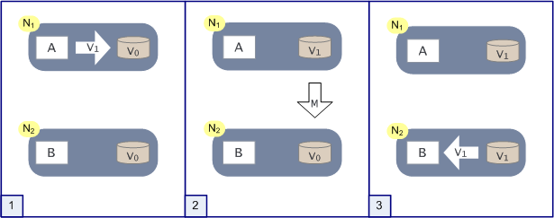
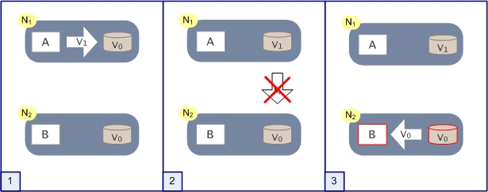

<h2 align="center">Brewer的CAP定理</h2>

 

[原文](https://www.julianbrowne.com/article/brewers-cap-theorem)

 

1976年6月4日，星期五，在离主音乐会礼堂（auditorium）不远处的一间楼上的小房间中，性感手枪乐队（[Sex Pistols](http://en.wikipedia.org/wiki/Sex_Pistols)）在曼彻斯特的[自由贸易大厅](http://en.wikipedia.org/wiki/Free_Trade_Hall)开启了他们的第一场演出。关于那天晚上观众到底是谁的说法让人有点疑惑，部分原因是因为仅仅六周之后这里又有另一场音乐会，但主要原因是因为它被认为是一场永远[改变了西方音乐文化](http://www.bbc.co.uk/print/manchester/content/articles/2006/05/11/110506_sex_pistols_gig_feature.shtml)的音乐演出。这是如此具有标志性和重要意义的事件，以至于大卫·诺兰写了一本书《[I Swear I Was There: The Gig That Changed the World](http://www.amazon.co.uk/gp/product/0954970497?ie=UTF8&tag=julibrow-21&linkCode=as2&camp=1634&creative=19450&creativeASIN=0954970497)》，investigating just whose claim to have been present was justified。因为通常认为6月4日是朋克摇滚的起源。

在这之前（事实上自从1971年）这里就已经有了大量的原型朋克（[Proto-Punk](http://en.wikipedia.org/wiki/Protopunk)）乐队（比如：[New York Dolls](http://www.punk77.co.uk/punkhistory/newyorkdolls.htm)和[Velvet Underground](http://en.wikipedia.org/wiki/The_Velvet_Underground)）。但正是这种由性感乐队（[Sex Pistols](http://en.wikipedia.org/wiki/Sex_Pistols)）创作的音乐在民俗（folklore）界掀起了一场革命，推动了Buzzcocks弹奏吉他的热潮，如[史密斯乐队](http://en.wikipedia.org/wiki/The_Smiths)的《哀嚎（plaintive wailing）》，[The Fall](http://www.dcs.ed.ac.uk/home/cxl/fall/index.html)不拘一格的（eclectic）切分音（syncopations），[Joy Division](http://en.wikipedia.org/wiki/Joy_Division) 的《威严（rising majesty）》和《Simple Red》（我想你不可能拥有一切）。

 
我们知道有三个和弦，但是你只能选择其中两个

2000年7月19日，星期三，与流行文化中的流行程度可能并不相同，但它对互联网规模的业务产生的影响与25年前性感手枪乐队对音乐的影响类似，因为这是Eric Brewer在ACM分布式计算原理研讨会（Symposium）上的主题演讲。

性感手枪乐队表明，对于他们那一代（contemporary）人来说，几乎不受约束（barely-constrained）的愤怒（fury）比艺术学院的结构主义（structuralism）更为重要，它赋予了任何拥有三和弦并想要表达自己的人组建乐队的能力。Eric Brewer在所谓的Brewer猜想中说：随着应用程序越来越依赖于网络，我们不应该再关心数据的一致性，因为如果我们想要这些新的分布式应用具有高可用性，我们就无法保证数据的一致性。因此，任何拥有三台服务器并可以敏锐地关注到客户体验的人都可以开启互联网规模的业务。在当天或者之后成为Brewer门徒的企业包括[亚马逊](http://www.infoq.com/news/2008/01/consistency-vs-availability)，[易趣](http://www.infoq.com/articles/ebay-scalability-best-practices)，[推特](http://highscalability.com/scaling-twitter-making-twitter-10000-percent-faster)。

两年后，在2002年，麻省理工学院的[Seth Gilbert](http://lpd.epfl.ch/sgilbert/)和[Nancy Lynch](http://people.csail.mit.edu/lynch/)正式证明Brewer是正确的（论文见👉[Brewer's Conje
ture and the Feasibility of
Consistent, Available, Partition-Tolerant Web
Servi
es](http://citeseerx.ist.psu.edu/viewdoc/download?doi=10.1.1.20.1495&rep=rep1&type=pdf)），因此，Brewer定理诞生了。

## Brewer的CAP定理

Brewer的定理到底是什么，为什么它可以与1976年曼彻斯特的朋克演出相提并论呢？

Brewer在2000年的演讲是基于他在伯克利大学的理论研究工作和观察[Inktoml](http://en.wikipedia.org/wiki/Inktomi)软件的运行状态所得到的结论。尽管Brewer和其他人谈论的是在此之前的几年，必须在高度可扩展的系统中作出取舍（trade off）（例如1997年SOSP的“Cluster-Based Scalable Network Services”和1999年的“Harvest, yield, and scalable tolerant systems”）。因此演示文稿中的内容不是最新的，并且与许多想法一样，它们是许多聪明人的工作（我相信Brewer本人会很快指出这一点）。

Brewer说：在分布式环境中设计和部署应用程序时，存在特殊关系中的三个核心系统需求（他专门针对网络进行讨论，但如今许多的公司业务都是多站点且遍布多个国家，所以这三个核心系统需求同样适用于你的数据中心/LAN/WAN网络）。

这三个需求是：**一致性**，**可用性**和**分区容错性**，为Brewer定理起了另一个名字：CAP。

为了让这些和现实世界联系起来，我们用一个简单的例子来表示：你想购买一份[托尔斯泰](http://en.wikipedia.org/wiki/Leo_Tolstoy)的《[战争与和平](http://en.wikipedia.org/wiki/War_and_Peace)》，以便在明天开始的一个特别漫长的假期中阅读。你最喜欢的网络书店还有一本库存（stock）。你进行搜索并在离开前检查是否可以交货，然后将其添加到购物车（basket）中。因为记得你还需要其他的一些东西，你可以在该网站停留一段时间（你是否曾在网上购买过一件东西？要最大化包裹（parcel）的价值）。当你阅读客户对防晒霜（suntan lotion）产品的评论时，其他地方的人访问该网络书店，并将唯一的副本添加到他们的购物车中，然后直接转到结账流程（他们急需修理摇晃的，一条腿比另一条腿短得多的桌子）。

- **一致性**

服务是否完全在运转或者全都不运转。在Gilbert和Lynch的证明中，他们使用了“原子性（atomic）”一词而不是“一致性（consistent）”，从技术上讲，这更有意义。因为严格来说，一致性（consistent）是ACID中的C，它在数据库事务中应用于一些合理的属性，这意味着数据将永远不会持久保存，从而不会破坏一些预设的约束。但是，如果你认为它是分布式系统的预设约束，即不允许同一段数据有多个值，那么我认为抽象的漏洞就被堵住了。此外，如果Brewer使用了“原子性（atomic）”一词，则需将其称为AAP定理，这么发音迟早会将我们都送进医院。

在买书的例子中，你可以将书添加到购物车中，否则失败。买或不买，你不能只添加书的一半并只付一半的钱。库存中只剩下一个副本，并且第二天只能有一个人可以买到它。如果两个客户都可以继续进行订购直到最后（即付款），则库存和系统之间缺乏一致性会引发问题。这个案例可能不是一个大问题，它只会导致有的人会在假期中感到无聊或者会浪费汤水。但是当这种情况扩大到成千上万个不一致之处，并给它们提供货币价值时（例如，在金融交易时，你购买或出售的商品与交易记录中的内容不一致），这将是一个很大的问题。

我们可以利用数据库解决不一致的问题。在订购过程中，《战争与和平》的库存量将会减一。当其他客户来买书时，橱柜里光秃秃的，订购过程将会提醒他已无存货，无需继续付款。第一个操作流程完全执行，第二个完全不执行。

数据库在这一点上非常有用，因为它们关注于ACID的特性并给我们提供一致性和隔离性。因此，当客户一将书的库存减一，同时又将购物车中书的数量加一时，任何中间状态都和客户二隔离，客户二必须等待几毫秒的时间直到数据存储执行了一致性操作。

- **可用性**

可用性的意思是 - 服务是可用的（如上所述：流程是否能够完整运行）。当你买书的时候你希望得到一个响应，而不是一些关于网站不能连接的浏览器信息。Gilbert和Lynch在他们的CAP定理证明中指出，可用性经常在你最需要它的时候将你抛弃 - 站点在繁忙时段掉线恰恰（precisely）就是因为它太繁忙了。服务可用但是却不可以被访问对任何人都没有好处。

- **分区容错性**

如果你的应用程序和数据库在一个节点上运行（忽略扩展性问题，并假设所有的代码都是完美的），该节点充当了一个原子处理器，它既可以工作也可以不工作（如果他崩溃了导致不可用，却也不会造成数据的不一致）。

一旦你开始在多个节点上分享数据和业务逻辑，他就有形成分区的风险。例如：当网络电缆（cable）被切断（chop）并且节点A无法与节点B通信时，就会发生分区。借助网络提供的分发功能，临时分区一种相对普遍的情况，而且正如我之前所说，在具有多个数据中心的跨国公司中临时分区也不是那么罕见。

Gilbert和Lynch将分区容错性定义为：

<i>不允许出现少于总网络故障的一组故障，从而导致系统无法正确响应</i>

并提到Brewer关于单节点分区等同于服务器崩溃的评论，因为如果无法连接到该分区，该分区可能也就不存在了。

## CAP理论的意义

CAP定理随着应用程序的扩展而变得栩栩如生。在事务很少的情况下，让数据库保持一致的轻微延迟不会对整体性能或用户体验产生明显影响。因此，你所做的任何负载分配都可能是出于系统管理的原因。

但是随着活动的增加，吞吐量（throughput）的这些关键点将开始限制增长并产生错误。必须等待网页返回响应是一回事，而输入信用卡详细信息后却遇到“HTTP 500 java.lang.schrodinger.purchasingerror”的错误又是另一种经历，想知道你是否为一件无法得到的商品付了钱，或者是根本没付钱，还是说这个错误对于这笔交易根本无关紧要（immaterial）。谁知道呢，你可能不会继续操作，更可能选择去其他地方购物，非常可能会打电话咨询你的银行账户。

无论哪种方式，都不适合业务发展。亚马逊声称，他们的响应时间仅增加了十分之一秒，就会使他们的销售收入减少1%。谷歌表示，他们主意到延迟仅仅增加了半秒，就导致流量下降了五分之一。

我在之前就写过关于可扩展性的文章，因此这里只重复两点，其他不再赘述：第一，虽然（whilst）解决的规模问题可能是架构问题，但最初的讨论不是，它们是业务决策。我很讨厌听到技术人员关于某个问题说因为当前的活动量不能证明这个方法是合理的，所以这个方法是没有保证的。并不能说他们是错的。通常来说，他们并非完全正确。在业务分析的过程中应该明确指出，从一开始（from the outset）限制规模就是隐式的制定收入决策。

第二点，一旦你围绕如何最大程度地扩大应用程序的规模展开讨论，世界就会大致分为两个意识形态（ideological）阵营：数据库用户何非数据库用户。

毫不意外的是，数据库用户就像数据库技术一样，将倾向于通过谈论[乐观锁](http://en.wikipedia.org/wiki/Optimistic_concurrency_control)和[分片](http://en.wikipedia.org/wiki/Shard_/(database_architecture/))来解决规模问题，从而使数据库始终出于核心地位。

非数据库用户将倾向于尽可能在数据库环境（避免关系领域）之外来管理数据以解决规模问题。

我认为可以公平的说，前一组并没有像后者一样完全热情的投入到CAP定理中（尽管他们正在谈论它）。这是因为如果你必须要放弃一致性，可用性或分区容错性其中之一的话，许多人会选择放弃一致性，这就是数据库存在（raison）的原因。这个逻辑，毫无疑问是因为可用性和分区容错性可以让你赚钱的应用程序保持活力，而不一致性问题感觉可以通过巧妙的设计解决。

就像IT中的其他内容一样，它不是非黑即白的。Eric Brewer在他的PODC演讲的第13张幻灯片中，比较ACID和非正式的BASE时，甚至说“我认为这是一个领域“。如果你对此主题感兴趣（有点超出我想在这里谈论的范围），最好从Haifeng Yu和Amin Vahdat的论文“[Design and Evaluation of a Continuous Consistency Model for Replicated Services](http://citeseerx.ist.psu.edu/viewdoc/download?doi=10.1.1.34.7743&rep=rep1&type=pdf)”开始研究。没有人应该将CAP解释为数据库可能已死。

就像曾经所想，双方都同意解决规模问题的答案是分布式计算并行化而不是超级计算机。Eric Brewer对90年代中期工作站网络项目的影响导致其体系结构暴露了CAP定理。因为正如他在关于[Inktomi和互联网泡沫](http://video.google.co.uk/googleplayer.swf?docid=4168901697847625272&hl=en&fs=true)的另一片演讲（presentation）中所说，答案一直都是处理器并行工作。

<i>如果他们不能并行工作，那么你将没有机会在合理的时间内解决问题，这和某些事情很像。如果你有一个非常繁巨的工作要做，就会有很多人去做这件事。因此如果你要建造一座桥梁，那么就会有很多建筑工人，这也是并行处理。因此其中很多事最终将转变为“我们如何将并行处理和互联网结合起来？”。</i>

## 图片中的证明

这是图片中的简化证明，因为我发现这样更容易理解。我将使用与Gilbert和Lynch相同的术语，以便将其与他们的论文联系起来(tie up with)。

 

 

上图显示了网络中的两个节点N1和N2，它们都共享一条数据V（库存中《战争与和平》的副本数），其值为V0。在N1上运行着算法A，我们可以认为它是安全，无错误，可预测且可靠。在N2上运行的是类似的算法B。在此实验中，A写入V的新值，而B读取V的值。

 

 

在晴天的情况下，会发生以下情况：（1）首先，A写入一个新的V值，称之为V1。（2）然后，消息M从N1上传递到了N2，并在那里更新了V的副本。（3）现在，B从V无论如何读取都将返回V1。

 

 

如果网络发生分区（即消息M无法从N1传递到N2），当第三步操作执行时，N2上包含的是一个不一致的V值。

这似乎看起来很明显。这种情况最多可以扩展到几百笔交易，已经成为了一个主要问题。如果M是一个异步消息，则N1无法知道N2是否接收到了这条消息。即使保证了M的正常传递，N1也无法知道消息是否因为分区事件或N2中发生故障而导致发生延迟。M如果是同步消息也无济于事，因为这会将A在N1上的写入以及从N1到N2的更新事件视为原子操作，这给了我们已经讨论过的（甚至更糟）的延迟问题。Gilbert和Lynch还对此进行了细微的改动（slight variation），证明即使在部分同步模型中（每个节点上都有有序的时钟），也不能保证原子性。

因此，CAP告诉我们的是，如果我们希望A和B具有高可用性（即以最小的延迟工作），并且我们希望从节点N1到Nn（其中n可能是成百上千个）保持对网络分区的容忍度（丢消息，无法传递消息，硬件故障，流程失败），然后我们会遇到这种情况：某些节点认为V是V0（库存中的《战争与和平》的副本数），其他节点认为V是V1（库存中的《战争与和平》无副本）。

我们真的希望一切都井井有条，一致且和谐，就像70年代初前卫的摇滚乐队的音乐一样，但是我们面对的是类似于朋克风的无政府状态（anarchy）。事实上，虽然这可能会吓到我们的祖母，但是一旦你知道这一点就可以了，因为两者可以很愉快地一起工作。

让我们从交易的角度快速的分析一下。

 

 

如果我们有一个称为a的事务（即基于持久数据项V的工作单元），则a1可能是之前的写操作，a2可能是读操作。在本地系统上，这很容易有数据库进行一些简单的锁定，隔离任何尝试在a2中读取的操作，直到a1安全完成。但是在具有节点N1，N2的分布式模型中，中间同步消息也必须完成。除非我们能够控制何时发生a2，否则我们无法保证它读到a1写入的相同数据值。所有的增加控制的方法（阻塞，隔离，集中管理等）都会影响到分区容错性或a1（A）和a2（B）的可用性。

## 处理CAP

解决CAP引发（throw up）的问题，你有几种选择，显而易见的是：

- 放弃分区容错性

如果要在没有分区的情况下运行，则必须阻止系统产生分区行为。一种实现方法是将所有的东西（与该交易相关）都放在一台机器上，或者放在一个原子故障单元（如机架）中。这不能保证系统100%正常运行，因为你可能还会出现部分故障，但不太可能出现分区的副作用。当然，这极大的限制了系统的可扩展性。

- 放弃可用性

这和放弃分区容错性的刚好相反。遇到分区事件时，受影响的服务只需要等待直到数据保持一致，因此在此期间保持不可用状态。在许多节点上进行控制可能会变得相当复杂，而可重新使用的节点则需要逻辑优雅的处理重新联机。

- 放弃一致性

或者，正如Werner Vogels所说，接受这些将会变得“最终一致”（2008年12月更新）。Vogels的文章值得一读，他详细介绍了更多的操作细节。

实际上，许多不一致的地方都不需要你想的太多（意味着持续的一致性可能根本不是我们所需要的）。在我的购书示例中，如果只有一本存货的书收到两个订单，那么第二本就变成了拖欠订单。只需告诉用户即可（记住这是一种十分罕见的情况），每个人可能都会很高兴。

- BASE跳跃

接受最终一致性的概念通过被称为BASE（基本可用，软状态，最终一致性）的体系结构方法得到支持。顾名思义，BASE和ACID在逻辑上相反，尽管暗示任何架构应该（或可以）完全基于一个或另一个架构是完全错误的。考虑到我们行业习惯采用糟透了的策略，这一点很重要。

在这里，我请Brewer教授本人给我发电子邮件对这篇文章发表一些评论，他说：

你在1997年SOSP文章中首次提出了“BASE”一词。那年早些时候，我和我的学生在他们的办公室里想出了一个缩写（acronym）。我承认它有点虚构（contrived），但是“ACID”也是如此一样远远超出人们的认识，因此我认为它足够好。Jim Gray和我讨论了这些首字母缩写，他欣然承认ACID也是一个延伸 - A和D的重叠度很高，C充其量是不确定的，但是这暗示了领域的概念，这是你正确指出PODC演讲的要点之一。

易趣的Dan Pritchett有一个关于BASE的不错的[演讲](http://softwaresummit.org/2007/speakers/presentations/PritchettArchitectingForLatency.pdf)

- 围绕CAP设计

<a src="http://www.atomikos.com/">atomikos</a>的CTO Guy Pardon写了一篇很有趣的帖子，他称之为“CAP的解决方案（证明Brewer是错误的）“，帖子中提到了一种架构方法，该方法可以在一些注意事项（caveats）下提供一致性，可用性和分区容错性（值得注意的是，你不能一次获得全部三个保证）。

这值得一读，因为Guy代表了这一领域的对立观点。

## 结论

你只能保证“一致性”，“可用性”，“分区容错性”其中两项是可以同时满足的，并且这被地球上最成功的网站证明了。如果对他们有用，我认为没有理由在公司环境的日常设计中不考虑相同的权衡取舍。如果企业明确不想扩大规模，那么可以使用更简单的解决方案，但是值得进行一次对话。无论如何，这些讨论都是针对特定操作的适当设计，而不是整个Shebang（#!）。正如Brewer在电子邮件中所说的那样，“我唯一要补充的是，统一服务的不同部分可以选择领域中的不同点”。有时候，无论扩展成本如何，你都[绝对需要一致性](https://www.julianbrowne.com/article/viewer/gangsta-scale)，因为没有一致性的风险太大。

这些天来，我甚至可以说亚马逊和易趣都没有可扩展性的问题，我认为他们过去有一个，而现在他们有了解决这个问题的工具。这就是为什么他们可以自由讨论它的原因。他们现在所做的任何扩展性（考虑到他们的已有的规模）的问题实际上都差不多。扩展后，你都问题将会被转移到运营维护，监控，推出软件更新等问题上 - 当然很难解决，但是当你可以获得这些收入流时，也是个不错的事情。